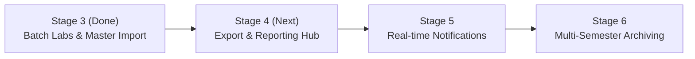

# RP-ACADSYNC — Project Handover & Transition Report

**Project Name**: RP-ACADSYNC (Academic Scheduling & Synchronization System)  
**Version**: V1.0.0 (Migrated from Supabase to Local SQLite Backend + React Frontend)  
**GitHub Repository**: [`https://github.com/Rugved-Patil/RP-ACADSYNC.git`](https://github.com/Rugved-Patil/RP-ACADSYNC.git)  
**Current Branch**: `main` (Latest commit: `f958521` — Clean working tree, all 37 tests passing)  
**Date & Timestamp**: October 2, 2026  

---

## 1. Executive Summary & Current Project Stage

RP-ACADSYNC is an automated, AI/GA-driven institutional timetable generation and academic management platform. The project has successfully transitioned from an external cloud dependency (Supabase/Postgres) into a self-contained, high-performance local SQLite application with a React + Vite + Tailwind CSS frontend.

### Current Stage: **Stage 3 Complete (Production-Ready College Data & Batch Lab Engine)**
* **Institutional Data Grounding**: Seeded with real-world engineering college curriculum (JNEC MGM University: ECT & AI-DS departments).
* **Batch Laboratory System**: Full support for dividing classes into **Batch A, Batch B, and Batch C**, scheduling concurrent practical labs in specialized rooms, and supporting standalone batch sessions.
* **Conflict-Free Genetic Algorithm (GA)**: Schedules 254 weekly periods across 6 classes with **0 hard constraint violations** in ~6–30 seconds.
* **Master CSV Streamlining**: Unified all data imports into a single, standardized master CSV format (`college_master_import.csv`) and removed confusing single-entity upload cards.
* **Quality Assurance**: 37 automated test suites passing (`npm test`), production frontend build passing (`npm run build`).

---

## 2. Comprehensive Inventory of What Was Built

### A. Laboratory & Student Batch Architecture
* **The College Batch Model**:
  * Classes of ~60 students are divided into 3 batches of ~20 students each: `Batch A`, `Batch B`, `Batch C`.
  * **Concurrent Parallel Labs**: Different batches of the same class attend different practical subjects simultaneously in different specialized rooms with different professors (e.g., at Wed 11:15–13:15: Batch A in *NLP Lab*, Batch B in *CN Lab*, Batch C in *PE-III Lab*).
  * **Standalone Batch Labs**: Individual batches can also have exclusive sessions (e.g. Saturday 15:00–17:00 for Batch B only while Batch A and C are free).
* **Database & Engine Implementation**:
  * [server/db.js](file:///Users/rugvedpatil/Desktop/20%20Python%20Projects/RP-ACADSYNC%20V1.0.0/server/db.js): Added `batch TEXT` column to `lessons` table with backward-compatible migrations.
  * [server/lib/generator.js](file:///Users/rugvedpatil/Desktop/20%20Python%20Projects/RP-ACADSYNC%20V1.0.0/server/lib/generator.js):
    * Expands practical subjects into 2-hour batch units per class batch (`Batch A`, `Batch B`, `Batch C`).
    * Implemented constraint checking separating whole-class slots (`classWholeSlots`) from batch slots (`classBatchSlots` and `classAnyBatchSlots`).
    * Added **Parallel Lab Synchronization Bonus** (+35 points per concurrent batch) to group batch labs into 2-hour blocks, maximizing free windows for theory lectures.
    * Integrated **Conflict-Directed Memetic Local Repair** that detects active collisions and resolves them in milliseconds.
* **UI & Timetable Visualization**:
  * [src/components/timetable/TimetableView.tsx](file:///Users/rugvedpatil/Desktop/20%20Python%20Projects/RP-ACADSYNC%20V1.0.0/src/components/timetable/TimetableView.tsx):
    * Updated collision detection: distinct batches of the same class in the same slot are recognized as **valid concurrent lab sessions**, eliminating false conflict warnings.
    * Stacked multi-batch cards inside the same time cell with distinct indigo badges (`[Batch A]`, `[Batch B]`, `[Batch C]`).
  * [src/components/timetable/TimetableEditDialog.tsx](file:///Users/rugvedpatil/Desktop/20%20Python%20Projects/RP-ACADSYNC%20V1.0.0/src/components/timetable/TimetableEditDialog.tsx):
    * Added interactive **Batch / Student Group** selector (`Whole Class`, `Batch A`, `Batch B`, `Batch C`) for adding or editing manual lessons.

---

### B. Standardized Master CSV Import System
* **Unified Single File Workflow**:
  * Created `college_import_data/college_master_import.csv` with the complete JNEC dataset.
  * Schema: `Record_Type,Name,Code,Year,Capacity,Periods_Per_Week,Is_Lab,Lab_Duration_Hours,Email,Specialization,Location,Equipment,Classes,Teachers`.
* **Backend Importer Engine** ([server/lib/importer.js](file:///Users/rugvedpatil/Desktop/20%20Python%20Projects/RP-ACADSYNC%20V1.0.0/server/lib/importer.js)):
  * Automatically detects master format via `Record_Type`.
  * Auto-provisions and links: Years $\rightarrow$ Classes $\rightarrow$ Classrooms & Labs $\rightarrow$ Faculty $\rightarrow$ Subjects & 2-Hour Labs $\rightarrow$ Teacher-Subject Assignments $\rightarrow$ Class-Subject Mappings.
  * Auto-generates staff logins (`<email>` / `teacher123`) and student representative logins (`student.<class>@jnec.ac.in` / `student123`).
* **UI Streamlining** ([src/pages/DataUpload.tsx](file:///Users/rugvedpatil/Desktop/20%20Python%20Projects/RP-ACADSYNC%20V1.0.0/src/pages/DataUpload.tsx)):
  * Removed confusing separate single-entity cards (Classes, Subjects, Teachers, Classrooms, Timings).
  * Made the Master Institutional Import the primary dropzone interface.
  * Added **Download Master Template (.csv)** button serving [public/college_master_import.csv](file:///Users/rugvedpatil/Desktop/20%20Python%20Projects/RP-ACADSYNC%20V1.0.0/public/college_master_import.csv).

---

### C. Timetable Layout & Orientation Controls
* **Primary Layout**: **Sideways: Days (Horizontal Rows) • Vertical: Time Slots (Columns)**.
* **Instant Toggle**: Users can switch between:
  1. *Sideways: Days • Vertical: Time Slots* (Default college timetable orientation).
  2. *Vertical: Days • Sideways: Time Slots* (Alternative period-row format).
* **Recess / Break Visuals**: Breaks and lunches display as distinct amber break bars/columns across all days.

---

### D. Administrative Controls & Safety Switches
* **Continuous Unique Data Generator** ([server/lib/adminData.js](file:///Users/rugvedpatil/Desktop/20%20Python%20Projects/RP-ACADSYNC%20V1.0.0/server/lib/adminData.js)):
  * "Generate More Data" button continuously introduces new departments, subjects, faculty, and classrooms with incremental counters, seamlessly merging with existing data.
* **System Kill Switch**:
  * "Delete All Data" button with double confirmation modal requiring the user to type `DELETE ALL DATA`.
  * Safely purges academic tables while strictly preserving the system administrator account (`admin@acadsync.edu`).

---

## 3. Active Dataset & Credentials Reference

### Active Institution Dataset (JNEC MGM University)
* **Classes (6)**: `SE-ECCE`, `SE-AIDS`, `TY-ECCE`, `TY-AIDS`, `B.Tech-ECCE`, `B.Tech-AIDS`.
* **Classrooms (16)**:
  * *7 Lecture Halls*: SF-31, SF-32, SF-33, TF-31, TF-32, FF-22, Jack Kilby Hall.
  * *9 Laboratories*: System Software Lab (FF-21), Programming Lab-1 (FF-28), Programming Lab-2 (FF-28), Analog Circuit Lab (FF-33), EDC Lab (FF-34), Communication Lab (FF-36), DMP Lab (FF-38), Data Science Lab-II (FF-40), Electronic Workshop Lab (FF-30).
* **Faculty Members (19)**: Dr. S. N. Pawar, Prof. F. I. Shaikh, Dr. V. B. Malode, Dr. V. A. More, Prof. V. A. Kulkarni, Prof. S. A. Annadate, Prof. G. R. Basole, Prof. A. P. Phatale, Prof. A. R. Salunke, Dr. C. S. Khandelwal, Prof. S. D. Jadhav, Prof. M. A. Mulay, Dr. S. D. Gavarskar, Prof. M. K. Pawar, Prof. P. B. Murmude, Prof. A. G. Patil, Prof. P. P. Patil, Prof. V. J. Lipne, Prof. R. L. Mudbe.
* **Curriculum**: 63 Subjects (36 Theory Courses, 27 Practical Laboratories).
* **Timing Schedule**: Standard Academic Schedule (Mon–Sat, 6 active teaching periods, 2 recess breaks).

### Credentials
| Role | Email | Password |
| :--- | :--- | :--- |
| **System Admin** | `admin@acadsync.edu` | `admin123` |
| **Faculty (All 19)** | `<teacher_email>` (e.g. `snpawar@jnec.ac.in`) | `teacher123` |
| **Students (All 6 Classes)** | `student.<class_slug>@jnec.ac.in` (e.g. `student.seece@jnec.ac.in`) | `student123` |

---

## 4. Roadmap: What to Build in Later Stages

When continuing in the next conversation, here are the logical next enhancements:

### Next Immediate Features (Stage 4 & Stage 5):
1. **Enhanced PDF & Print Export**:
   * Add high-resolution PDF generation with institutional letterhead (MGM University / JNEC header logo).
   * Batch print option: Export individual timetable PDFs for all 19 teachers and 6 classes in a single zip archive.
2. **Calendar Sync (iCal / Google Calendar)**:
   * Generate `.ics` feed URLs for teachers and students so their assigned batch labs and theory lectures sync to their mobile devices.
3. **Faculty Substitution & Temporary Reassignment**:
   * Build an automated "Find Substitute" engine when a faculty member takes leave, recommending teachers who share the same subject qualification and are free during that specific slot.
4. **Email / SMS Notification Dispatch**:
   * Hook change request approvals to automated email triggers so students and faculty are instantly alerted when a lecture is moved or room is reassigned.

---

## 5. Instructions for Resuming in a New Conversation

When opening a new conversation tab, provide this initial prompt to the assistant:

### Prompt to Copy-Paste into the New Tab:
> "Hello! I am continuing development of **RP-ACADSYNC V1.0.0** (Academic Scheduling & Synchronization System).
> 
> **Current Context**:
> * **Repository**: `https://github.com/Rugved-Patil/RP-ACADSYNC.git` on branch `main`.
> * **Backend**: Node.js + Express with local SQLite database at `server/data/acadsync.db`.
> * **Frontend**: React + TypeScript + Vite + Tailwind CSS.
> * **Completed**:
>   1. Local SQLite migration from Supabase.
>   2. Sideways Days / Vertical Time Slots timetable orientation.
>   3. Institutional Batch Laboratory system (Batch A, B, C concurrent lab scheduling in specialized labs with 0 hard violations).
>   4. Master Institutional CSV Importer (`college_master_import.csv`) with automatic relational linking and template download.
>   5. Admin safety tools (continuous unique data generator & double-confirmation kill switch).
> * **Credentials**: Admin login is `admin@acadsync.edu` / `admin123`.
> 
> Please read the handover report at `handover_report.md` or review git log, and let me know when you are ready to proceed with the next phase."

### Files & Documents to Reference in the New Tab:
1. **Handover Report**: [handover_report.md](file:///Users/rugvedpatil/.gemini/antigravity/brain/0ad60f05-5c8f-4679-a08e-ebbaf7fed848/handover_report.md)
2. **Master CSV Dataset**: [college_import_data/college_master_import.csv](file:///Users/rugvedpatil/Desktop/20%20Python%20Projects/RP-ACADSYNC%20V1.0.0/college_import_data/college_master_import.csv)
3. **Scope Document**: The original project scope PDF/text document (if available in workspace or uploaded).
4. **Core Generator Engine**: [server/lib/generator.js](file:///Users/rugvedpatil/Desktop/20%20Python%20Projects/RP-ACADSYNC%20V1.0.0/server/lib/generator.js)
5. **Main Timetable View**: [src/components/timetable/TimetableView.tsx](file:///Users/rugvedpatil/Desktop/20%20Python%20Projects/RP-ACADSYNC%20V1.0.0/src/components/timetable/TimetableView.tsx)

---
*Report generated and verified on branch `main` at commit `f958521`.*
