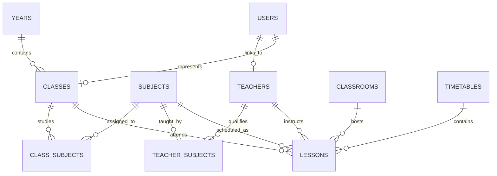
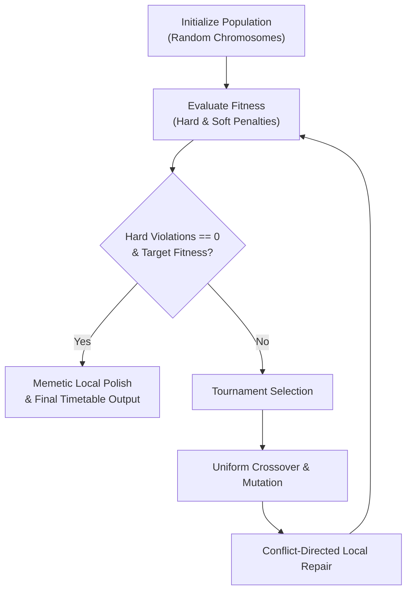
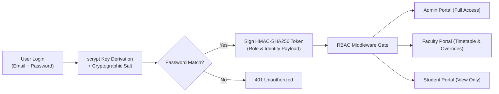

# RP-ACADSYNC — System Architecture & Project Scope Document

**System Version**: V1.0.0  
**Project Lead**: Rugved Patil  
**Target Environment**: Academic Institutions & Engineering Colleges (Pre-configured for JNEC MGM University)  
**Database**: Local SQLite (WAL Mode, `better-sqlite3`)  
**Frontend**: React 18, TypeScript, Vite, Tailwind CSS, shadcn/ui, Radix UI  
**Backend**: Node.js Express API + Python Gemini 3.6 Flash Assistant Sidecar  

---

## 1. System Vision & Objective

**RP-ACADSYNC** (Academic Scheduling & Synchronization System) is an autonomous, AI-assisted platform designed to resolve NP-hard timetable scheduling challenges for higher education institutions.

The platform automates the generation of conflict-free weekly schedules while supporting complex institutional workflows such as:
1. **Concurrent Laboratory Sessions**: Scheduling `Batch A`, `Batch B`, and `Batch C` simultaneously across specialized laboratories with dedicated faculty.
2. **Strict Credit-Hour Mapping**: Direct translation of syllabus credits into contact lecture and practical hours.
3. **Role-Based Governance**: Dedicated portals for Administrators, Faculty, and Students.
4. **Resilient Data Operations**: 100% lossless single-file master CSV import/export and double-confirmed emergency resets.

---

## 2. Institutional Domain Model & Relational Architecture

The SQLite database (`server/data/acadsync.db`) maintains complete relational integrity with foreign keys and cascade rules.

### Entity Specifications
1. **Academic Years (`years`)**: Defines cohorts (e.g. `First Year (FY)`, `Second Year (SE)`, `Third Year (TY)`, `Final Year (B.Tech)`).
2. **Classes (`classes`)**: Student divisions (e.g. `SE-ECCE`, `SE-AIDS`, `TY-ECCE`, `TY-AIDS`, `B.Tech-ECCE`, `B.Tech-AIDS`).
   * **Batches**: Subdivided into `Batch A`, `Batch B`, and `Batch C` (~20 students each).
3. **Classrooms & Laboratories (`classrooms`)**:
   * **Lecture Halls**: Standard capacity rooms (`is_lab: 0`).
   * **Specialized Laboratories**: Equipped labs (`is_lab: 1`) such as *Programming Lab*, *Analog Circuit Lab*, *DMP Lab*, *Communication Lab*, etc.
4. **Faculty Members (`teachers`)**: Department instructors with email, designation, max daily load, and subject qualifications.
5. **Subjects & Courses (`subjects`)**:
   * **Theory Courses**: Standard 1-hour lectures (`is_lab: 0`).
   * **Practical Labs**: 2-hour continuous sessions (`is_lab: 1`, `lab_duration_hours: 2`).
6. **Time Slots (`time_slots`)**:
   * Default daily window: `10:00 - 17:00` (Monday through Saturday).
   * 6 Teaching Periods of 1 hour each.
   * 2 Structured Recesses (Lunch Break `12:00 - 12:45` & Afternoon Tea `14:45 - 15:00`).

---

## 3. Academic Credit Model & Calculation Rules

The system strictly enforces standard academic contact hour mathematics:

$$\text{Theory Weekly Hours} = \text{Credits} \times 1\text{ Hour (Single 1-hour periods on distinct days)}$$

$$\text{Practical Weekly Hours} = \text{Credits} \times 2\text{ Hours (One 2-hour laboratory block)}$$

### Credit-to-Session Breakdown Table

| Course Type | Credits | Contact Hours / Week | Schedule Representation |
| :--- | :---: | :---: | :--- |
| **Theory Lecture** | 4 | 4 Hours | 4 separate 1-hour lectures on 4 distinct days |
| **Theory Lecture** | 3 | 3 Hours | 3 separate 1-hour lectures on 3 distinct days |
| **Theory Lecture** | 2 | 2 Hours | 2 separate 1-hour lectures on 2 distinct days |
| **Practical Laboratory** | 1 | 2 Hours | 1 continuous 2-hour session per batch in specialized lab |
| **Practical Laboratory** | 2 | 4 Hours | 2 continuous 2-hour sessions per batch in specialized lab |

---

## 4. Conflict-Free Genetic Algorithm (GA) Engine

The scheduling solver ([`server/lib/generator.js`](file:///Users/rugvedpatil/Desktop/20%20Python%20Projects/RP-ACADSYNC%20/server/lib/generator.js)) uses an evolutionary meta-heuristic combined with **Memetic Conflict-Directed Local Search**.

### Constraint Hierarchy

#### Hard Constraints (Penalty: $-\infty$ / Generation Blocked)
1. **Teacher Clashing**: No teacher may instruct more than one session at the same time slot.
2. **Class Clashing**: A class cannot have multiple whole-class lectures in the same period.
3. **Batch Clashing**: The same batch cannot be assigned to multiple lab sessions simultaneously.
4. **Room Clashing**: No classroom or laboratory can host two sessions at once.
5. **Lab Room Verification**: Laboratory subjects must be scheduled in rooms flagged with `is_lab = 1`.
6. **2-Hour Continuity**: Practical labs cannot span across scheduled recess periods.

#### Soft Constraints (Fitness Optimization: $+10$ to $+50$)
1. **Parallel Lab Concurrency Bonus (+35 pts)**: Rewards scheduling `Batch A`, `Batch B`, and `Batch C` in the same 2-hour window.
2. **Even Day Distribution (+20 pts)**: Spreads theory courses across Monday through Saturday rather than clustering on two days.
3. **Faculty Daily Load Smoothing (+15 pts)**: Prevents teacher burnout by capping daily periods to `max_periods_per_day` (default 4).
4. **Break Adherence**: Protects student lunch breaks from lecture encroachments.

---

## 5. Security & Role-Based Access Control (RBAC)

Authentication is implemented natively using Node.js cryptographic primitives without cloud external dependencies.

### Security Details
* **Password Hashing**: Native `scrypt` with 16-byte random hex salt per account and 64-byte key output.
* **Token Structure**: Header, Base64Url JSON Payload, and HMAC-SHA256 Signature (7-day validity).
* **Sanitization**: Password hashes and salts are stripped by `sanitizeUser()` before returning API payloads.

---

## 6. AI Chatbot Assistant (Gemini 3.6 Flash)

The system features an autonomous intelligent chatbot accessible via a sleek circular floating action button (FAB) in the lower-right corner.

* **Engine**: Python script (`server/chatbot/assistant.py`) called via Express backend (`/api/chat`).
* **Model**: Google Gemini 3.6 Flash (`gemini-3.6-flash`).
* **Context Grounding**: Dynamically injects live database state (classes, teachers, rooms, daily timetable) into system instructions, enabling accurate answers to natural language questions such as:
  * *"Where is Dr. S. N. Pawar teaching on Monday at 10:00?"*
  * *"Which batch is in the Analog Circuit Lab on Thursday?"*
  * *"How do I export the master CSV backup?"*

---

## 7. 8 Artisan Visual Design Themes

The UI token system implements 8 distinct themes:

| # | Theme Identifier | Scheme | Mood & Character |
|---|---|---|---|
| 1 | `linen-olive` | Light | Warm tactile linen with deep Mediterranean olive tones |
| 2 | `slate-sage` | Light | Misty parchment balanced with Nordic pine & sage |
| 3 | `terracotta-dune` | Light | Sun-drenched desert clay, sand dunes & earthenware |
| 4 | `nocturne-olive` | Dark | Obsidian charcoal canvas with glowing sage-olive highlights |
| 5 | `espresso-oat` | Light | Cashmere oatmeal with rich dark roast coffee & hazelnut |
| 6 | `indigo-parchment`| Light | Crisp Oxford cloth paper and deep midnight navy blue |
| 7 | `burgundy-tweed` | Light | Heathered rose tweed with deep vintage Bordeaux wine |
| 8 | `nordic-moss` | Dark | Deep boreal emerald with alpine lichen & frosted amber |

---

## 8. Verification & Test Suite Summary

The system is validated by **39 automated tests** (`npm test`):
1. **Admin Data Management**: Kill-switch purge & lossless re-seed verification.
2. **Authentication & RBAC**: Hashing determinism, token tampering detection, password validation, role guard middleware.
3. **AI Chatbot**: Validation of system responses against live database queries.
4. **Database Persistence**: SQLite schema integrity, foreign keys, transaction rollback.
5. **Multi-Format Exporters**: Full-week and single-day CSV, Excel, HTML, and JSON exports.
6. **Genetic Algorithm**: 0-hard-violation generation across all active classes.
7. **Master CSV Importer**: Complete relational linking of classes, batches, labs, teachers, and subjects.
8. **Teacher Change Requests**: Free slot calculations, collision rejections, admin approvals, and schedule overrides.
